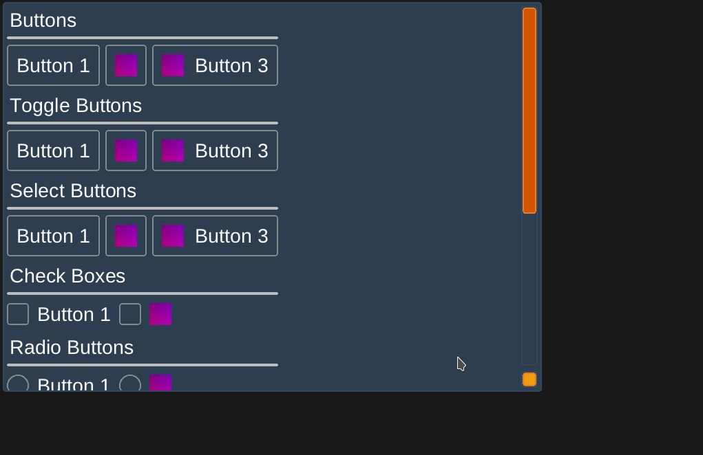
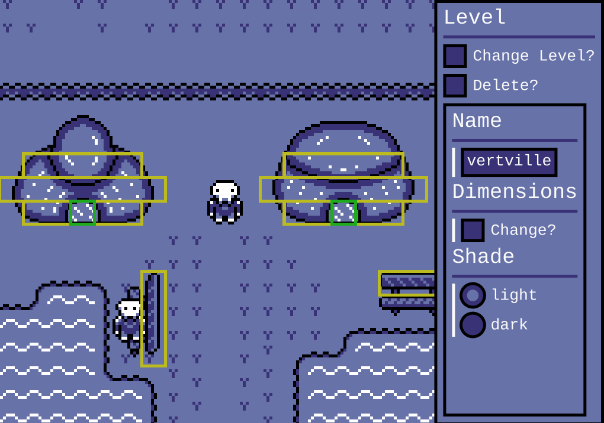

# VUI

VUI (virtual user interface) is an immediate mode UI library aimed to be easy to use & customizable.

Want to see this library being developed live? <br/>
Catch the development stream on **[Twitch](https://twitch.tv/heroseh)** every **Monday, Tuesday, Wednesday @ 1PM GMT**

Inspired by (in no particular order):
- [Dear IMGUI](https://github.com/ocornut/imgui)
- [Casey Muratori's Talk](https://www.youtube.com/watch?v=Z1qyvQsjK5Y)
- [Handmade Network Podcast with Micha Mettke](https://handmade.network/podcast/ep/c1174949-adc4-492d-89b5-ca73dea4ff16)

# Features
- No dependencies (expect libc)
	- But requires hooking up to sub systems of your application. See the **backends** directory.
- Basic Controls (Buttons, Check Box, Radio Button, Progress Bar, Text Box, Input Box, Scroll View, Sliders, Multi Line Text Box)
- Advance Layout System
	- Controls can be offset and aligned to the center, each edge or each corner
	- Automatic, Fill Parent and Fill Ratio of Parent sizing.
	- vui_stack_layout (default): Lays out controls on top of each other
	- vui_row_layout: Lays out controls in rows (vertically) & supports wrapping
	- vui_column_layout: Lays out controls in columns (horizontally) & supports wrapping
- Styling: controls can be styled allowing you to change the margin, padding, background color, border, radius and more
- Handles the Input, Layout and Rendering the UI to an array of draw calls
	- Draw calls have a texture, vertices and indices that you send directly to a graphics library like OpenGL
- Can be used for Games and Applications (We still need to have some examples of these)
- Style Animations

# Aims
- C99 Compatibility
- Cross Platform
	- The library itself has been written in a cross platform way. We just need to test and correct.
- Stable Internal API to create custom controls
	- This is possible right now but the API will break a little.
- Good Examples & Documentation
- A Complete Set of Controls (Drop Down Box, Panels, Tables, Graphs etc)

# Usage

Everywhere you need to use this library, put this at the top of the file:
```
#include "vui.h"
```

In a single compilation unit, include the source file.
```
#include "vui.c"
```

# Documentation

All of the Control API is documented in the **vui.h** file. The rest of the API needs documentation but you can see the **examples/ctrl_gallery.c** for a working example of the VUI using stb_truetype, SDL2 and OpenGL. At the moment this has only been setup to work on Linux. However, it shouldn't be too hard to see how the example works and reflect that in your project especially if you use SDL2, OpenGL and stb_truetype.

# Screenshots

## The Control Gallery Example Project
Showing off the all the controls we have. If you run Linux, you can test this out yourself by checking out the **examples** directory.


----

## Embedded Editor Tools in a Game
An example of this library being used in my game for the embedded editor tools.
Notice how there is a completely custom style and the UI is actually scaled along side the Game's scale.



